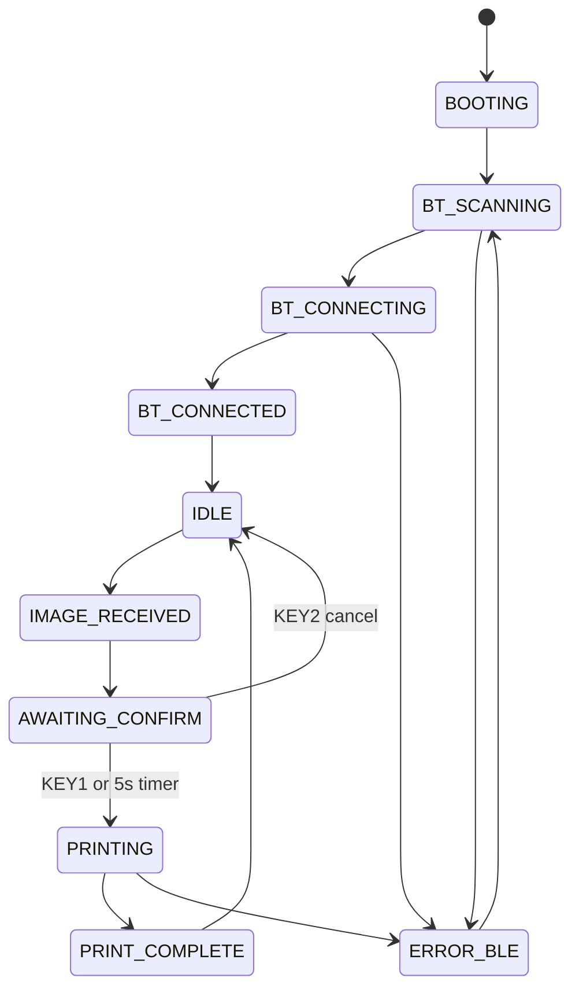

# UX Flows

Display: 240x240 LCD, event-driven render loop, 1-2 fps maximum unless an animation needs a short burst.

Virtual LCD (plan 054-A): every screen below is also phone-renderable. The sync service serves the
live 240x240 frame over `GET /v1/screen` and accepts the same abstract `UiAction`s (up/down/left/
right/select/back/help/pair) over `POST /v1/input`, so the InstantLink iOS app can mirror and drive
the physical LCD. It renders the identical `ui.snapshot` frame and injects into the same controller
input queue as GPIO — there is no separate phone UI. Gated by `[sync] remote_ui` (default on).

## Screen Templates

### Splash

```text
+----------------------+
|     InstantLink Bridge    |
|                      |
|   starting...        |
|                      |
|  battery icon  BT    |
+----------------------+
```

### Ready

```text
+----------------------+
| Ready                |
| Bridge Wi-Fi | Sq 8/10|
|   Ready              |
|   to print           |
| Waiting for upload   |
| Next photo in order  |
| K1 Set · K2 Lock · K3 Post |
+----------------------+
```

The screen only says `READY` / `Ready to print` when both ends are healthy: at least one FTP
receive path is visible and the selected printer has a current status read with film available.

**Delivery modes (plan 055).** Print and Sync are mutually exclusive:

- `Mode: Print` uses the Printer and requires a current status with film available.
- `Mode: Sync` replaces the print framing with a `Sync to iPhone` headline and drops the
  printer rows entirely. Readiness requires an FTP receive path **and** a listening sync service
  (see "Sync-service honesty" below); the printer is irrelevant.
- Existing `destination = "both"` configuration is accepted as a legacy value and starts in Print
  mode. New configuration writes only `print` or `iphone`.
- The Sync READY card includes an `iPhone` row: `N pending` (outbox depth) and/or
  `active` (an authenticated app request within the last 20 s — the iOS app polls every ~4 s
  while foregrounded, so this tracks "the app is open and talking to us"; the word is `active`,
  not `connected`, because the pull API holds no persistent link — plan 051 P3.9). The pending
  count is a per-language template (P3.10): zh-Hans renders the numeral flush against the
  measure word (`3张待传`), EN keeps `3 pending`.

**Sync-service honesty (plan 051 P2.3).** The sync surfaces reflect the *actual* HTTP listener
state reported by the app layer, not just config:

- `starting` (boot window, or a Mode change queued a restart): Sync shows the standard
  WAITING/validation treatment with the mild cause `Sync starting`.
- `listening`: sync-ready claims and the pairing QR are allowed.
- `unavailable` (start failed — port bind, construction): Sync degrades to the validation body
  with the cause `Sync failed · restart bridge`. The status pill reads `Waiting`, and the status
  bar drops to not-ready.

**Pair-iPhone nudge (plan 051 P2.7).** While sync is enabled and listening but no client has
*ever* connected since boot, the READY card shows a one-time discoverability line:
`Pair iPhone: press KEY3`.
It disappears permanently (for the boot) after the first authenticated app request and never
returns when the 20 s `active` chip ages out.

Power status is global UI chrome, not a separate workflow. The current X306 battery case exposes
battery state through hardware LEDs only, so the LCD shows `Battery case` / `LED only` in System
settings rather than fake bridge battery percentage. It should not show the X306 SKU in the normal
title bar or imply that the UPS chassis is the bridge device name. If a telemetry-capable backend is
configured later, the normal status surfaces show bridge battery percentage and charging/input
state. At 20% battery, the UI should show a low-battery warning without blocking an active print. At
10% battery while not on external power, the UI should show a critical-battery shutdown message and
let the power monitor request safe shutdown through its injected shutdown callable.

If either side is not healthy, the same readiness surface uses `WAITING` and shows the validation
state and concise causes:

```text
+----------------------+
| Ready check          |
|       WAITING        |
|     Ready check      |
| FTP: no FTP Wi-Fi    |
| Printer ready 8/10   |
| Choose FTP Wi-Fi     |
| K1 Set · K2 Lock · K3 Post |
+----------------------+
```

The renderer keeps these lines short for the 240x240 LCD. Common causes are `Choose FTP Wi-Fi`,
`Wait for printer status`, `No printer signal`, `Check saved Printer`, `Replace film
pack`, and `Find printer`.

### No Film

```text
+----------------------+
| Needs attention      |
|       NO FILM        |
|    No film left      |
| Type: Mini           |
| Replace film pack    |
| K1 Set · K2 Lock · K3 Status|
+----------------------+
```

The NO FILM full screen applies to Print mode. Sync mode ignores film entirely.

### iPhone Pairing (SYNC_PAIRING)

Opened from Settings ▸ Network ▸ `iPhone pairing`, or directly with KEY3 from the home surface
in Sync mode.

```text
+----------------------+
| Pairing              |
|    iPhone pairing    |
|  +----------------+  |
|  |   QR code on   |  |
|  |  white card    |  |
|  +----------------+  |
| Scan with InstantLink app |
|      KEY2 Back       |
+----------------------+
```

- The QR encodes `instantlink://pair?v=1&device=…&host=…&port=…&token=…` plus the hotspot
  SSID/PSK when the bridge AP is the active FTP path. It renders black-on-white regardless of
  theme (scanner contrast) and is LRU-cached.
- Only KEY2/LEFT exits; every other key is ignored so a stray press cannot dismiss the code
  mid-scan. Exit returns to the originating Settings page, or to the home surface when opened
  with KEY3 from home.
- **Dead-port guard (plan 051 P2.3).** The action never shows a QR encoding a port nothing
  listens on. Instead it opens context help from home, or a Settings message: `Switch to Sync mode first` in Print mode,
  `Sync starting · try again` during the async-start window, and
  `Sync failed · restart bridge` after a failed start.
- **Idle exemption (plan 051 P2.5).** Aiming a phone at the LCD generates no GPIO/FTP events,
  so DIM/SCREEN_OFF/deep-idle escalations are converted into power activity while the QR is up —
  the screen never dims or blanks mid-scan. The critical-battery shutdown request is deliberately
  NOT exempted. Normal idle behavior resumes on exit (the key press is real activity).
- **Incoming images defer (plan 051 P2.4 + pass 2).** An FTP upload arriving mid-scan neither
  shows IMAGE_RECEIVED nor starts the preview/print flow: the queue consumer holds the image
  until the QR exits, then runs the normal flow (countdown restarted, NO FILM shown then if
  applicable). Nothing prints behind the QR; queue/outbox chips keep updating.
- **Token rotation (plan 051 P3.11).** The QR embeds the long-lived bearer token (plus the
  hotspot PSK), so a photograph of the screen is persistent access. The revocation story is
  Settings ▸ Network ▸ `Reset sync token`: a destructive two-press confirm
  (`Reset sync token?` / "A new pairing token will be generated. All paired iPhones must scan
  the new QR.") regenerates the token file (0640, same format as first boot) and restarts the
  sync service so it re-reads the file — every previously paired iPhone gets 401s until it
  scans a fresh QR. The surface reflects the restart through the sync-service state flow
  (`starting` → `listening`; a failed rebind degrades to `Sync failed · restart bridge`), and
  the dead-port guard keeps the QR action blocked during the window. A QR opened afterwards
  always carries the new token: the payload is rebuilt from the file on every entry, and the
  raster cache is keyed by the payload, so a stale QR cannot be served.

### Boot Printer Setup Prompt

Shown at boot when no `INSTAX-*` printer is selected.

```text
+----------------------+
| Printer setup        |
|   No printer selected|
| > Find printer       |
|   Status             |
| Up/Dn KEY1 Select    |
+----------------------+
```

### Preview

```text
+----------------------+
|  preview image area  |
|                      |
| Preview / Print in 5 |
| Crop: 4-way pan KEY3 |
| KEY1 print           |
| KEY2 cancel          |
+----------------------+
```

### Printing

```text
+----------------------+
|  preview thumbnail   |
|                      |
|      PRINTING        |
|  sending to Instax   |
+----------------------+
```

### Settings Menu

```text
+----------------------+
| Settings             |
|                1/4  |
| > Print             >|
|   Network           >|
|   System            >|
|   Mode         Print |
| KEY2 Back KEY3 Help  |
+----------------------+
```

Settings has four root entries: **Print**, **Network**, **System**, and **Mode** (Print/Sync).
It remains accessible without a saved Printer through KEY1.

- Print opens **Post**, **Transform**, **Workflow**, and **Printer**, in that order.
- Post contains **Looks** (creative colour, saved presets and overlays) and **Correction**
  (independent Printer saturation compensation). Changing or saving a Look leaves Correction
  untouched. Correction defaults to zero for compatibility, accepts −100..+100%, and previews
  the combined result while editing. It applies after the Look at print resolution before JPEG
  encoding. Sync mode preserves the original camera file.
- Transform controls image fit and JPEG quality.
- Workflow names its three stored choices **Confirm each** (`None`), **Print immediately** (`0s`),
  and **Review 5s** (`5s`). No-film test, Keepalive, and Search rate appear below Advanced.
- Printer contains Serial, Pair/Re-pair, Reconnect, Forget, and Printer type. Re-pair/Forget use
  explicit confirmation. Reconnect checks the saved device without changing its identity.
- Network combines camera Hotspot/Client setup, Wi-Fi/FTP credentials, diagnostics, iPhone
  pairing, and credential/token reset controls. USB is for administration only.
- System contains appearance, language, text size, power behavior, `Unlock: 3 presses`, and About
  diagnostics.

RIGHT/KEY1 opens a category or editor. UP/DOWN selects a row; KEY2/LEFT backs out. KEY3 opens
context help in a dialog that preserves the selected row, picker and working edit. In saved
preset pickers, RIGHT opens management; KEY3 remains Help. Settings titles reserve measured
space for the status dot and counter at all text sizes.

Setting changes persist to `/etc/InstantLinkBridge/config.toml`. Wi-Fi mode switching runs through the
root-owned helper `/usr/local/sbin/instantlink-bridge-wifi-mode`, limited by
`/etc/sudoers.d/instantlink-bridge-wifi`.

## Hardware Controls

The UI is designed for the Waveshare 240x240 square LCD HAT, not touch input.

| Control | GPIO | Boot UI action |
| --- | ---: | --- |
| Joystick up | 6 | Move selection up |
| Joystick down | 19 | Move selection down |
| Joystick left | 5 | Back/cancel in Settings |
| Joystick right | 26 | Select focused item / next value |
| Joystick press | 13 | Select focused item / next value |
| KEY1 | 21 | Open settings / select focused item |
| KEY2 | 20 | Lock the LCD on home; back/cancel elsewhere |
| KEY3 press/hold | 16 | The visible context action; Help in Settings |

Home/status footer semantics (plans 059/060):

| Surface | KEY1 | KEY2 | KEY3 |
| --- | --- | --- | --- |
| Print ready | Settings | Lock | Post |
| Saved Printer offline | Settings | Lock | Reconnect |
| No saved Printer | Settings | Lock | Pair |
| No film | Settings | Lock | Status/reload guidance |
| Sync home | Settings | Lock | iPhone status/QR |
| Settings | Select | Back | Help |
| Preview | Print | Cancel | Tool |
| Printing | — | Lock | — |
| Error | Settings | Back | Check (never resend a photo) |

Short and long KEY3 presses perform the same visible action. Manual lock and automatic screen-off
use the same unlock sequence described below. Locking during a print does not cancel it: active
preparation and printing stay boosted, then the idle dark Bridge returns to its lowest supported
clock.
Home identifies **Printer battery**, current Look, workflow and any nonzero Correction; camera
setup addresses are in Network. X306 has no charge telemetry, so no Bridge charge is invented.
The completion screen says **Print complete**, without claiming a separate ejection stage.

### Lock and unlock

`Settings → System → Unlock: 3 presses` defaults to **On**. It applies to manual lock and
automatic screen-off, on both physical and virtual LCDs.

1. Press any key once. The LCD wakes to an **Unlock** prompt showing **1 / 3**. The Bridge starts
   its awake CPU tier immediately and prepares the current interface.
2. Press any key again. The prompt shows **2 / 3**.
3. Press any key a third time. The latest underlying screen appears. All three inputs are
   consumed by unlocking; a fourth input performs its normal labelled action.

The keys may be the same or different. Physical buttons must be released between presses;
holding a key counts once. Virtual input uses the same controller and each accepted action is a
press.

An incomplete sequence has a fixed **10-second timeout from the first press**. On expiry the
LCD becomes dark again and the count resets. The idle CPU returns to its lowest supported
clock; active image preparation or printing retains its performance boost. FTP, Sync and
Printer reconnect continue throughout, and live status or photo changes are retained behind
the unlock prompt.

Set the toggle to **Off** to use one-press wake: the first input wakes and repaints the latest
screen without executing a normal action. The next input performs the labelled action.

Wake must repaint even when the current screen is unchanged. Screen-off can clear the physical
framebuffer, so matching an old cached active snapshot is insufficient evidence that its pixels
are still present. The display restores its retained frame before enabling the backlight, and
the controller invalidates its render cache for dark stages and unlock transitions. See
[plan 061](../../docs/plans/061-bridge-three-press-unlock.md) for the implementation and validation
record.

## State Diagram



## Auto-Print Timer

- **Print immediately**: skip preview and print after FTP receive.
- **Review 5s**: start the five-second review after the preview appears. Editing or selecting a
  tool switches that photo to manual confirmation; press KEY1 to print.
- **Confirm each**: show a preview and wait for KEY1/joystick press to print.
- Cancel interrupts preparation through the killable worker and releases the CPU boost promptly.
- The LCD shows the preview image, `Print in N.Ns` for timed mode, and the active edit tool.
- KEY3 cycles edit tools: `Zoom`, `Crop`, and `Rotate`.
- In `Zoom`, joystick up/right zooms in and down/left zooms out.
- In `Crop`, all joystick directions pan the crop window and the LCD hint says `Crop: 4-way pan`;
  entering crop mode guarantees a visible crop.
- In `Rotate`, joystick left/right rotates the image in 90 degree steps.
- KEY2 cancels and deletes the pending job.
- Any BLE disconnect pauses transition and surfaces `ERROR_BLE`.
- New uploads while waiting are queued by path and processed one by one after the current preview or
  print finishes. The runtime queue accepts up to `100` completed FTP uploads.
- If the Bridge already knows the selected Printer has `0/10` film when an image arrives in Print
  mode, it shows `No film left` and skips BLE transfer. In Sync mode the print path is skipped
  entirely and the image spools to the sync outbox.
- While the SYNC_PAIRING QR is on screen, arriving images are held before the preview/no-film/
  auto-print flow runs (plan 051 pass 2): nothing prints or switches modes behind the QR, and the
  deferred image proceeds normally (timer restarted) once the user exits with KEY2/LEFT.

## Print Progress

After the auto-print timer expires, the LCD must show explicit print stages instead of a generic
printing screen.

| Stage | LCD title | Detail |
| --- | --- | --- |
| Printer lookup | `Checking printer` | `Looking up printer` |
| Endpoint selection | `Finding printer` | Selected `INSTAX-*` name |
| BLE connect | `Connecting` | Selected printer name |
| Decode/resize | `Preparing image` | Detected output type |
| BLE transfer | `Sending N%` | `done/total chunks` and JPEG size |
| Handoff | `Finishing` | `Waiting for printer` |

## Error Screens

| Error | Two-line text | Recovery hint |
| --- | --- | --- |
| BLE not found | `Printer not found` / `Scanning nearby` | Move printer closer or hold KEY3 to pair |
| FTP Wi-Fi lost | `FTP link lost` / `Check Wi-Fi` | Reconnect to Bridge Wi-Fi or Same Wi-Fi |
| Wrong mode | `Camera not ready` / `Use playback FTP` | Select playback and press C1 |
| Image too large | `Image too large` / `Could not prepare` | Retry with a smaller still image |
| Decode unsupported | `Image unsupported` / `Could not decode` | Use JPEG/HIF, or install RAW support |
| No film | `No film left` / `Replace pack` | Reload the matching Instax film pack |
| Battery low | `Printer battery low` / `Charge printer first` | Retry after charge |
| Cover open | `Cover open` / `Close printer cover` | Retry when latched |
| Printer busy | `Printer busy` / `Wait for Instax` | Retry in a moment |
| Paused/jammed | `Printer paused` / `Check Instax` | Clear printer and retry |
| Disk full | `Storage full` / `Cleaning cache` | Wait for cache eviction |
| Queue full | `Queue full` / `Try again soon` | Wait for current print |
| Captive interrupt | `Setup active` / `Printing paused` | Finish or exit setup |
| SD corruption | `Storage error` / `Service locked` | Reimage card from known-good image |

## LED Patterns

Logical patterns; final hardware output may be printer LED, LCD icon, or optional case LED.

| Condition | Pattern |
| --- | --- |
| Ready | Solid dim green |
| Receiving | Fast blue pulse |
| Awaiting cancel window | Blue countdown pulse |
| Printing | Slow white pulse |
| Complete | Two green blinks |
| Recoverable error | Amber double blink |
| Fatal error | Red triple blink |
| Low battery warning | Amber slow blink |
| Safe shutdown | Red fade out |

## Buzzer Patterns

Logical patterns; buzzer hardware is optional and deferred.

| Condition | Pattern |
| --- | --- |
| Image received | One short chirp |
| Print started | Two short chirps |
| Print complete | One medium chirp |
| Cancel | Low short chirp |
| Recoverable error | Two low chirps |
| Fatal error | Three low chirps |
| Low battery | One low chirp every 60 s |
