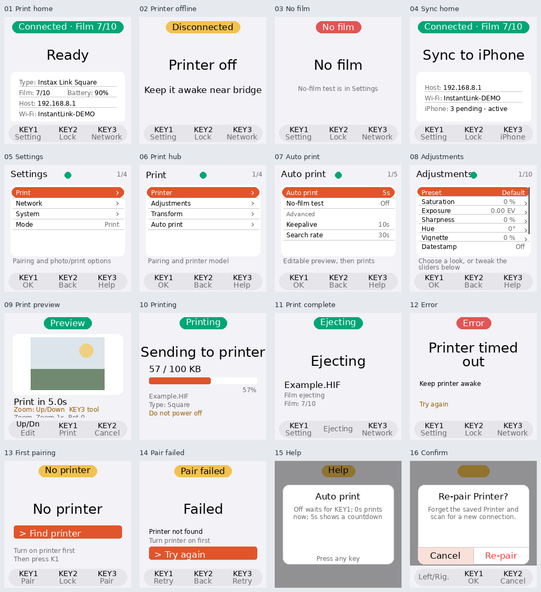
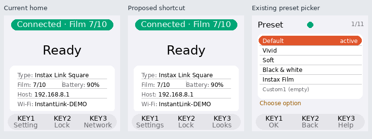

# 059 — Bridge interface UX audit and KEY3 recommendation

Audit date: 2026-09-30. Scope: the Bridge's physical LCD and shared virtual LCD state machine,
GPIO/abstract input, onboarding, Print/Sync home, reconnect, Settings, preview/editing, printing,
completion, errors, pairing, confirmation/help, lock/wake and performance tiers.

This is an audit and design proposal. **The KEY3 binding and other runtime behaviors have not
been changed by this audit.**

## Evidence

- Read `ui/input.py`, `models.py`, `controller.py`, `render.py`, `settings.py`, and the UX docs
  against worktree `codex/bridge-battery-day`. The Pi runs source `892945a`; later branch commits
  before this audit changed documentation only.
- Generated 16 frames with the installed renderer and Pi fonts on Raspberry Pi Zero 2 W /
  Waveshare 240×240 LCD HAT, Debian 13.2. These are synthetic state examples, **not photos of
  the physical screen or captures of a user session**. Names, addresses, help text and preview
  artwork are examples. The Sync example deliberately retains Printer fields to expose the
  renderer's treatment of cached Printer information; normal mode transitions may clear them.
- Reproduced the unpaired-home SELECT/HELP routing, PRINTING/BACK no-op, ERROR/BACK footer
  mismatch and automatic-screen-off SELECT behavior with local controller probes, mocking BLE
  work. `PYTHONPATH=bridge/src` selected the audited worktree source.
- Read live GPIO logs: KEY3 generated `help` on the home Printer-searching screen and opened
  Network. No pairing, credential changes or film-consuming operations were performed.
- Measured the Settings title against the fixed status dot with the actual Pi fonts: the
  `Adjustments` title ends at x=119 in medium and x=137 in large; the dot begins at x=114.

## Overall assessment

The core menu controls are usable: joystick navigation, KEY1 select/confirm, KEY2 back/cancel,
explicit option lists, preserved working adjustment values, and confirmations that initially
focus Cancel. Printer recovery and camera receive remain automatic. Locking preserves the
photo workflow and photo jobs receive full CPU performance.

The main weaknesses are the physical keys' changing meanings, privileged placement of setup
tasks, and timing/wake behaviors that do not match what the display promises. The home screen
devotes space to Host/SSID, duplicates film information and omits the active look and auto/manual
workflow—information that matters after camera setup is complete.

## Findings in priority order

| Priority | Finding and evidence | Recommended behavior |
|---|---|---|
| P1 | **Settings is unreachable from unpaired Print home.** KEY1/joystick select and KEY3 both start pairing; KEY2 locks. A user cannot choose Sync mode through the LCD without first pairing a Printer. | KEY1 always opens Settings on home, including unpaired/error states. KEY3 Pair provides first-time Printer setup; Mode remains accessible without a Printer. |
| P1 | **The five-second review period can disappear.** `await_print_confirmation` starts its deadline before `_build_preview_image`. The recent image takes about 5.7 seconds to prepare at 1 GHz, consuming a five-second deadline before a useful preview exists. Editing does not suspend that deadline. | Begin the review countdown when the preview is visible. The first edit switches that photo to explicit confirmation. Preserve a separate immediate-auto option for users who want maximum throughput. This makes a real five-second review slower than today's timer on a slow image; make the workflow choice explicit. |
| P1 | **A long KEY3 press starts pairing from paired Print home.** GPIO hold emits PAIR after 1.2 seconds; the controller starts a scan, suspends status polling and closes the cached session. This differs from the Network label on short press. | Remove the hidden pairing shortcut from normal home. Reconnect targets the saved Printer; choosing a new Printer lives in Settings with clear confirmation. Long press should share the visible action unless a separately labelled hold action is needed. |
| P2 | **KEY2 cannot lock during printing.** The controller returns immediately for PRINTING before processing BACK. | KEY2 locks the LCD during sending/printing without cancelling the job; full CPU performance remains held until the job ends. Display `KEY2 Lock`. |
| P2 | **Error footer promises Lock but KEY2 refreshes status.** ERROR falls through to the home-style footer but is excluded from `LOCKABLE_HOME_MODES`. | Explicit error controls: KEY1 Settings, KEY2 Back, KEY3 Retry where recovery is meaningful. Explain whether Retry rechecks the Printer or retries a photo. Do not automatically resend an uncertain print, which could consume a second sheet. |
| P2 | **Automatic screen-off and manual lock wake differently.** Manual lock consumes the first input; automatic screen-off can both wake and execute the input, such as opening Settings with SELECT. | The first input only wakes either kind of dark screen. The next input performs the labelled action. |
| P2 | **KEY3's ready-home shortcut is a setup task.** Print home opens Network, even when the Printer is offline or film is empty. Credentials/diagnostics are already in Settings. | Ready Print home: Looks or Auto/Review. Offline: Reconnect the saved Printer. Unpaired: Pair. Labels must name the actual action. |
| P2 | **The active print workflow is unclear.** Auto print's `Off` means wait for KEY1, rather than stop accepting photos or pause printing. Home does not show the current look or workflow. | Use `Confirm each`, `Print immediately`, and `Review 5s`. Show the current look and workflow on home. A true Pause would require defined queue/storage behavior and should not be implied by the existing Off value. |
| P2 | **Settings title overlaps the status dot.** The fixed centered dot collides with Adjustments at medium/large sizes. | Reserve title space or move the dot beside the counter; test medium, large and Chinese labels in the actual 240×240 layout. |
| P2 | **Cancelling preview preparation leaves work running.** BACK resolves the confirmation future, but the coroutine still awaits `_build_preview_image` before the photo dispatch finishes and releases its CPU boost. | Cancellation should stop the killable image worker for that job and release its boost promptly. |
| P3 | **Daily workflow and maintenance are mixed.** No-film test appears above Advanced, alongside Auto print; polling controls and quality/model details remain relatively prominent. | Group diagnostics under Advanced. Put Look, crop/fit and confirmation behavior first. |
| P3 | **Completion and status language are inconsistent.** The completion screen shows Ejecting for a fixed two-second interval after the print call completes. Home's Battery value refers to the Printer; X306 cannot report Bridge charge. | Distinguish verified completion from ejection in progress. Label Printer battery clearly; do not invent Bridge charge/runtime values. |
| P3 | **Documentation describes an older hierarchy.** UX docs describe five root sections and Mode under Print; code has Print, Network, System, Mode. Help presentation also differs between ordinary rows, pickers and adjustment edit. | Align documentation with the implementation after the interaction decisions are applied, and make contextual Help presentation consistent. |

## Better KEY3 functions

| Candidate on ready Print home | Value | Tradeoff |
|---|---|---|
| **Looks / preset picker — preferred default** | Direct access to Default, Vivid, Soft, Black & white, Instax Film and saved looks. It shortens the current Settings → Print → Adjustments → Preset route and supports everyday photography. | Show the active look on home. Apply only after selection; do not blindly cycle or silently overwrite custom adjustments. |
| **Auto/Review picker** | Choose immediate printing, a visible review countdown, or explicit confirmation for each photo. Useful for controlling film use. | Needs clear labels and a visible home indicator. Opening a picker is safer than a hidden one-press toggle. This is not a true pause/resume feature. |
| **Last photo / review** | Inspect the latest received photo and optionally print another copy. | Requires defined file retention, a review state and confirmation before reprinting. There is currently no gallery/history UI; it is a larger feature. |
| **Quick controls** | A small sheet containing Look and Auto/Review gives both shortcuts. | Flexible, but adds another menu. Prefer a single direct action until usage shows both are frequently needed. |

Reconnect is the strongest **offline-state** KEY3 action, rather than the default ready-state
action. It should request an immediate, bounded check of the saved Printer and leave normal
background reconnect intact. Reset/re-pair remains an explicit escalation in Settings.

Film/battery/network status already appears on home or in Settings, so an information-only
status shortcut offers less value. Direct reprint should never be a single unconfirmed press.
Print/Sync stays in Settings as requested. Sync is pulled by the iOS app: a `Sync now` key would
promise an operation the Bridge cannot currently initiate.

## Recommended key model

| Context | KEY1 | KEY2 | KEY3 |
|---|---|---|---|
| Print home, ready | Settings | Lock | **Looks** |
| Saved Printer offline | Settings | Lock | **Reconnect** |
| No saved Printer | Settings | Lock | Pair |
| No film | Settings | Lock | Printer status / reload guidance |
| Sync home | Settings | Lock | iPhone status/pairing panel |
| Settings | Select | Back | Help |
| Photo preview | Print | Cancel | Tool: Zoom / Crop / Rotate |
| Sending/printing | No action | Lock | No action unless a useful details view exists |
| Error | Settings | Back | Relevant retry/check |
| Dark screen | Wake only | Wake only | Wake only |

The existing preview Tool action is useful; keep it visible and use consistent `KEY3 Tool`
wording instead of hiding it in a small body line while the footer lists joystick movement.
The same abstract actions, captions and behaviors must apply to physical and virtual input.

This concept shows a changed home label followed by the **existing** preset picker. It does
not implement the shortcut, revise the active-look home card or change the runtime.

## Implementation sequence and acceptance

1. Fix onboarding Settings access, visible review timing, manual locking during printing,
   error captions/actions and consistent wake consumption. Verify photo cancellation releases
   preparation and its performance boost.
2. Select the ready-home KEY3 action (Looks is the recommendation), remove hidden re-pairing,
   add the active look/workflow to home and route offline KEY3 to a bounded saved-Printer check.
3. Correct title/dot layout across font sizes and languages, move maintenance controls under
   Advanced, and align docs with the final hierarchy.

Validation needs controller tests for the timing/key behaviors, state-render checks for
captions/layout, and real key presses on the Waveshare HAT. Camera/Printer verification must
include a slow HIF preview, edit/cancel, locked printing, reconnect and a first-run Sync setup
with no Printer. Film-consuming retries require explicit user intent. Battery behavior must
retain 600 MHz locked idle and 1 GHz during photo jobs.
