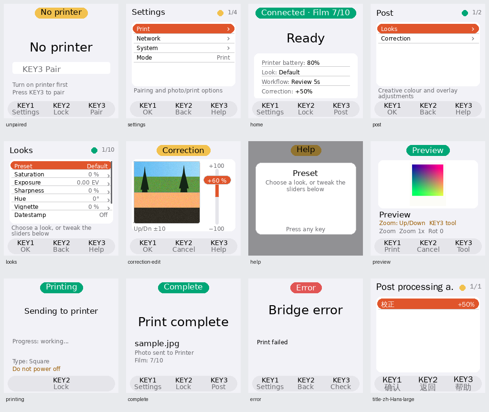

# 060 — Bridge Post processing and interface fixes

Date: 2026-09-30. Follows the observations in plan 059; its screenshots remain a record of the
previous interface. The user authorized implementation and validation of the audit, then selected
**Post** for KEY3 and requested independent film colour compensation beneath creative Looks.

## Interaction

KEY1 opens Settings on every home surface, including unpaired and failed pairing. Settings root
contains Print, Network, System and Mode. Print contains Post, Transform, Workflow and Printer.
Post contains Looks and Correction. KEY3 opens Post when ready, wakes the saved-Printer check
when offline, pairs only when unsaved, provides reload guidance with no film, and opens iPhone
status/QR in Sync. Short and held KEY3 have the same action; re-pair remains explicit in Settings.
Saved Look slot management moves to RIGHT so KEY3 consistently opens context Help.

KEY2 locks home/status and printing without cancelling a print. First input on every dark screen
only wakes; this is captured before the activity callback can clear automatic screen-off. Error
uses Settings / Back / Check; checking never resends a photo. Reconnect coalesces with bounded
existing checks and retains the minimum scan gap and saved device identity.

Preview preparation runs outside the action queue in the existing killable worker. Review time
starts after the first frame appears. Editing or selecting a tool requires manual confirmation
for that photo. Cancel terminates preparation, discards stale frames/cache and releases the job
boost. The timeout commit is sealed before asynchronous cleanup so late inputs cannot claim to
cancel an already accepted print. Interrupted preview sessions resolve rather than wait forever.

## Independent output correction

`BridgeConfig.correction.saturation` is an integer from −100 to +100, default 0. It is stored in
its own TOML table and management payload. Existing adjustment values remain unchanged on load;
choosing, editing, saving or deleting a Look does not affect correction. The LCD Correction editor
uses the existing sample preview, with staged changes, KEY1 commit, KEY2 cancel and KEY3 Help.

The pipeline is: decode/orient → creative Look and crop/fit → independent Printer correction at
final print resolution → JPEG encoding/model orientation → Printer. Saturation correction maps
to a colour factor of `1 + value/100`; neutral is a no-op. It is user tuning, not a measured
film calibration. The small final image keeps its processing cost low. Corrected LCD image and
printed image share prepared bytes; Printer, adjustment or correction changes invalidate reuse.
Both Rust FFI and diagnostic Bleak paths forward the same corrected prepared image. Original
camera files delivered to the iOS app in Sync mode remain unchanged.

A locked prepared preview waiting for confirmation uses the idle CPU tier; actual preparation,
rebuilds and accepted printing acquire a boost, which releases on failure/cancellation.

The App exposes a separate Printer correction control, preserves older Bridge responses with a
zero default, and includes correction in draft validation/diff/revert. Its sample preview is
approximate, as are the pre-existing Look sample controls. New copy is present in all 12 locales.
See [management configuration](../reference/bridge-management.md).

## Remaining audit fixes

- Workflow choices say Confirm each, Print immediately and Review 5s while preserving None/0/5.
- Home shows Look, workflow, nonzero Correction and explicitly labelled Printer battery.
  Camera setup addresses are available in Network; X306 has no fabricated percentage.
- No-film test and connection polling appear below Advanced; daily photo controls come first.
- Settings titles are measured/truncated before the status dot and counter, at all font sizes.
- Printing displays KEY2 Lock; previews display Print / Cancel / Tool.
- Unpaired/failed pairing body guidance names the actual KEY3 action.
- Completion says Print complete / Photo sent to Printer, rather than implying an ejection stage.
- Context Help preserves row selection, picker state and staged editor values.
- Live UX documentation and Bridge context are updated; plan 059 remains historical evidence.

## Validation

Local coverage includes correction neutrality/byte identity, worker/inline parity, corrected
preview reuse, independent config/API persistence, invalid type/range rejection, App old-response
decoding and draft behavior, real killable-worker cancellation, countdown timing/edit pause,
status-interrupted preview completion, timeout boundary input, saved reconnect cadence, dark wake
callback races, printing lock, preset Help and six language/font-size title-spacing cases.

Final validation: **1198 Bridge tests**, **152 App tests**, Ruff, strict mypy and strict MkDocs
pass. The repository localization check reports the same existing gaps as its baseline; all new
keys are present across 12 locales. Runtime `10fd031` was deployed through a clean archive.
On-device shared UI, real CPU helper and killable worker smoke passed; transitions used stock
1000/600 MHz, including powersave while a dark prepared preview waits. Rendering uses installed
Pi fonts. Screens below use synthetic device data and an example photo, rather than physical LCD
photographs. Nine additional layout regressions ensure photo text stays above the footer at all
three text sizes.

Device smoke details are recorded in bridge/docs/current-context.md. Real camera upload, Printer power cycling/film output and physical GPIO confirmation
require the corresponding hardware to be on. Battery runtime still requires a full discharge;
software tests and clock checks do not establish 16 hours of endurance.
