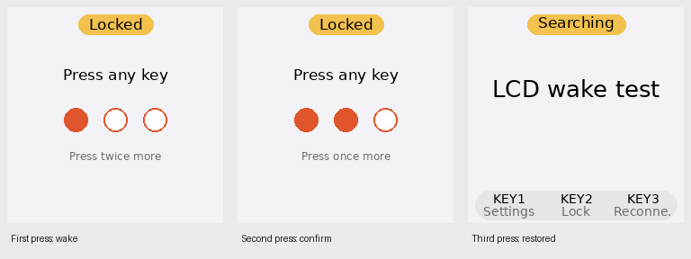

# 061 — Bridge three-press unlock and reliable LCD wake

Date: 2026-09-30. Scope: shared physical/virtual LCD lock presentation, input routing, CPU wake,
framebuffer restoration, stored UI configuration and the App's Bridge management contract.

## User report and decision

After locking, a key press could enable the LCD backlight while leaving a blank display rather
than restoring the Printer-searching screen. The user requested a three-press unlock flow:
any key may advance it, the option defaults on, and the first press starts waking/preparing the
interface so it is ready by the third press.

The setting is `Settings → System → Unlock: 3 presses`, persisted as
`[ui].unlock_requires_three_presses = true`. Disabling it restores one-press wake; that first
input still performs no normal action.

## Blank-display cause and fix

Screen-off could write black pixels to the framebuffer. The controller retained its last
active snapshot, so unlocking to an identical active state triggered snapshot-equality
suppression and skipped repainting. Enabling the backlight therefore did not guarantee visible
content.

Two cooperating fixes address this:

- The framebuffer display retains its rendered frame and restores it before enabling the
  backlight on wake.
- The controller invalidates its rendered-snapshot cache when applying a dark stage and when
  unlocking. It repaints the current state even when it equals the pre-lock frame, including
  when the three-press option is disabled.

## Interaction and state handling

- Manual lock and automatic screen-off use the same flow. First press shows `UNLOCKING` with
  `1 / 3`, starts the awake CPU tier and awaits the governor transition before processing later
  queued inputs. Second press shows `2 / 3`; third press removes the overlay.
- All three inputs are consumed. Only the next input performs its labelled screen action.
  Same-key and mixed-key sequences are valid. GPIO uses press-only callbacks with 50 ms
  debounce and no held-key or autorepeat events; release is required before another physical
  press. Accepted virtual actions are discrete presses.
- An incomplete sequence has a fixed 10-second timeout after its first press. Expiry returns
  to a dark locked screen and resets the count. Idle CPU returns to the lowest supported
  clock; active image preparation or printing keeps its boost.
- The controller retains the live underlying state during the unlock overlay. Printer status,
  incoming photos, Settings selection, working edits and ongoing jobs continue normally.
  Completing the sequence displays the latest state, rather than a saved stale screenshot.
- `ui.snapshot` supplies the physical/virtual unlock presentation. `ui.live_snapshot` supplies
  operational FTP readiness and photo dispatch so the overlay does not change receive policy.
- The GPIO and remote surfaces still inject the same abstract actions. No separate unlock
  state machine or new remote-input action is introduced.

## Configuration contract

The management schema exposes boolean `ui.unlock_requires_three_presses`. Missing stored values
and older responses default to `true`; non-boolean updates are rejected with that field's error.
The App mirrors the field, presents a toggle and includes it in configuration diffs. The current
unlock sequence uses its chosen gate; changing the setting determines later wake behavior.

## Validation record and remaining acceptance

At the local integration checkpoint, **1,241 Bridge tests and 154 App tests passed**. The
controller/routing checkpoint passed 262 tests, and strict mypy passed for the controller.
Regression coverage includes all abstract keys, consumed third input, first-press CPU readiness
before queued unlocking, fixed timeout/reset, retained Printer/photo state, one-press opt-out,
forced repaint of an identical home state, framebuffer restoration, configuration validation,
App field round trips and unlock rendering across font sizes/languages. Ruff, touched-file
formatting, strict mypy (65 source files) and strict MkDocs pass. App strings cover all 12 locales;
the global localization check still reports its previously verified baseline gaps.

Clean source `fb1f27e` was deployed to the Pi Zero 2 W / Waveshare ST7789 LCD HAT on Debian 13.2.
Film-free smoke under the `ib` runtime account verified real framebuffer restoration and
backlight 4→0, both progress frames, restoration of a newer underlying error, same-key/mixed-key
sequences, opt-out wake and automatic screen-off. Actual CPU transitions were 600 MHz locked →
1000 MHz on first press → 600 MHz after incomplete-sequence expiry → 1000 MHz on opt-out wake.
The Bridge service was restored after the check and remains active with `NRestarts=0`, throttling
`0x0` and a working hotspot FTP listener. See `bridge/docs/current-context.md` for hardware details.

Physical GPIO and battery acceptance remain pending:

1. Raspberry Pi Zero 2 W / Waveshare LCD HAT: lock from Printer-searching, unlock using the
   same key three times and then mixed keys; verify the third press restores content and the
   fourth executes its normal action.
2. Hold a key and verify it counts once; leave the sequence incomplete and verify a dark
   screen after 10 seconds, with a new sequence starting at `1 / 3`.
3. During a real preparation/printing job, verify work continues and retains its boost
   through physical lock/unlock.
4. Verify camera receive, saved-Printer reconnect and virtual input remain operational, with
   current status restored on unlock. Film-consuming tests require deliberate print intent.

No new power-consumption or 16-hour runtime claim follows from these interaction changes.
