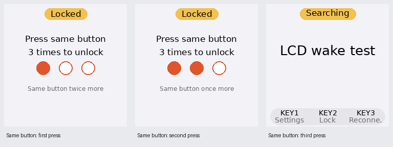

# 062 — Same-button consecutive unlock correction

Date: 2026-10-01. Scope: unlock control identity, the shared physical/virtual input queue and
live documentation. This corrects the mixed-key behavior recorded in plan 061; its framebuffer
wake fix, default-on setting and first-press CPU preparation remain applicable.

## User correction

Unlock must require **the same physical button three consecutive times**. Three arbitrary
inputs are insufficient. Pressing a different button starts a new count at one, without extending
the existing fixed 10-second timeout.

## Updated behavior

- The first press of any physical button wakes the unlock prompt at `1 / 3`, starts the awake
  CPU tier and prepares the current interface.
- Releasing and pressing that same button again advances to `2 / 3`; a third consecutive
  press restores the latest live screen. The successful three presses are consumed. No
  normal screen action occurs until the next input.
- A different button resets the counter to `1 / 3` and becomes the new required button.
  Every input is consumed while the unlock prompt remains open. For example, KEY1, KEY2,
  KEY2, KEY2 unlocks on the final KEY2; KEY1, KEY2, KEY3 does not unlock.
- GPIO identity is retained alongside the abstract action. KEY1 and joystick press are distinct
  physical controls despite both normally producing Select. Each joystick direction is a
  distinct control. Holding a control counts once; release is required before another press.
- The incomplete sequence expires 10 seconds after its original first press. Different-button
  resets do not refresh the timer. Expiry returns to dark locked idle and clears the sequence.
  Active image preparation or printing continues with its performance boost.

## Virtual input contract

The existing `POST /v1/input` body remains `{"action": "<action>"}`. Each remote action has a
stable internal `remote:<action>` control identity. Three consecutive identical action requests
unlock; a different action resets the count to one without extending the timer. Remote identities
are distinct from physical GPIO identities, so switching input surfaces resets progress instead
of combining presses.

The physical and virtual interfaces still share one controller, render path and unlock overlay.
No optional button field or separate remote unlock state machine is introduced. Operational
readiness and photo dispatch continue reading live state beneath that overlay.

## Configuration and existing guarantees

`[ui].unlock_requires_three_presses` remains boolean, default `true`, exposed at Settings →
System → `Unlock: 3 presses` and mirrored by the App's Bridge management UI. With it disabled,
one press wakes and repaints the current screen without executing its normal action.

The first-press CPU transition, retained framebuffer restoration, forced repaint, latest-state
restoration and background receive/reconnect behavior from plan 061 remain in effect.

## Validation and hardware acceptance

Final checks passed: **1,247 Bridge tests**, **154 App tests**, Ruff, touched-file formatting,
strict mypy (65 source files), whitespace and strict MkDocs. App wording covers all 12 locales.
The duplicate pre-commit App compilation was stopped under extreme host load after the same
App check had already passed independently; the commit reused those completed results.
Regression coverage includes:

- Same-button completion with the third press consumed.
- Mixed-button reset, including KEY1 versus joystick Select.
- The original timeout remaining fixed across repeated resets.
- Repeated identical remote actions, changed-action reset and physical/remote identity separation.
- Preserved live state, first-press CPU readiness and one-press opt-out.

Clean source `8dadb69` was deployed to the Raspberry Pi Zero 2 W / Waveshare ST7789 LCD HAT
on Debian 13.2. Film-free smoke under the `ib` account verified real framebuffer/backlight
restoration, both updated prompts, same-button completion, latest-state redraw, mixed-button
reset including KEY1/joystick Select identities, timeout after changing buttons, opt-out and
automatic-dark wake. CPU checks used actual 600/1000 MHz stock tiers. Inputs were injected
with their GPIO identities; no physical switch was actuated. Services and hotspot FTP are
healthy after the check. Full hardware details are in `bridge/docs/current-context.md`.

Physical press/release/hold acceptance remains pending, along with camera/Printer/film checks.
This record does not establish battery consumption or a 16-hour runtime result. Earlier plan 061
mixed-key smoke is historical evidence and does not verify this corrected rule.
